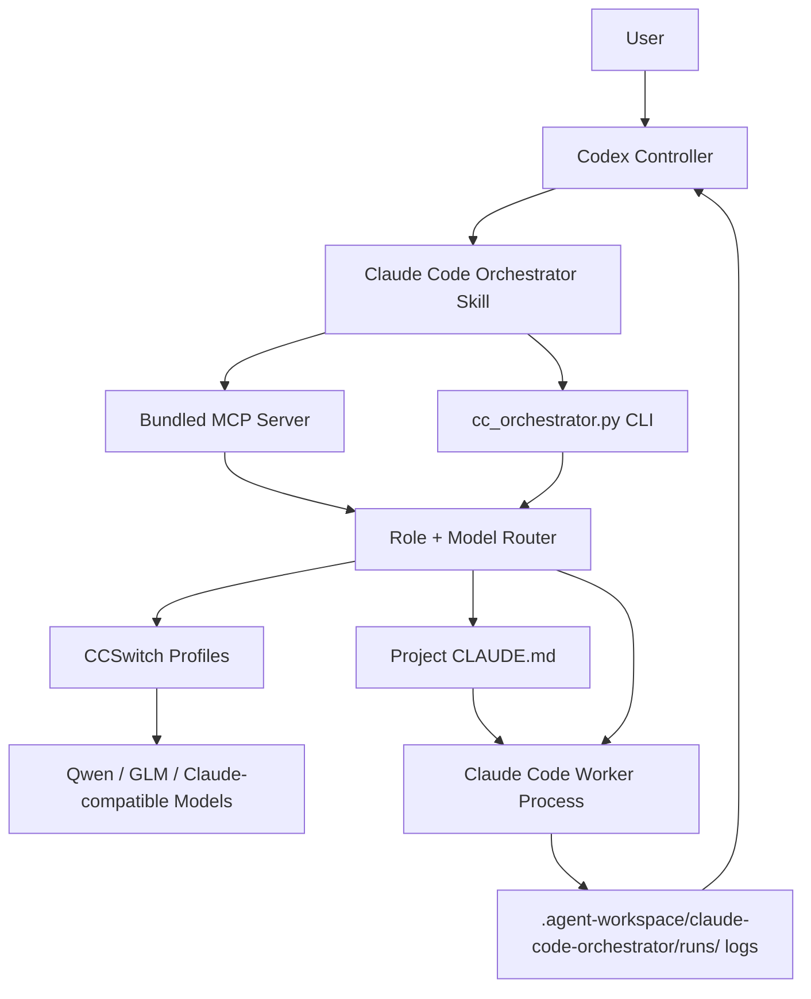

<p align="center">
  
</p>

<h1 align="center">Claude Code Orchestrator Skill</h1>

<p align="center">
  <b>A world-class multi-agent engineering harness for Codex, Claude Code, CCSwitch, and local model routing.</b>
</p>

<p align="center">
  <b>Make Plus feel like Pro.</b>
</p>

<p align="center">
  <a href="README.zh-CN.md"></a>
  <a href="LICENSE"></a>
  
  
  
  
</p>

<p align="center">
  中文版文档：<a href="README.zh-CN.md"><b>README.zh-CN.md</b></a>
</p>

---

<h2 align="center">Plain-English Pitch</h2>

GPT-class models are excellent.

But Plus-level quotas are not infinite.

If you spawn many internal subagents directly inside Codex, your best-model quota can disappear fast.

A deep repo audit, a parallel multi-agent review, or one ambitious refactor can burn through the budget you wanted to save for judgment.

That is why this Skill exists.

The mission:

> Make Plus feel like Pro.

This Skill turns that constraint into an engineering system:

> Let the best model act as the brain.
> Let Claude Code plus your CCSwitch models act as hands.
> Let Codex stay in control.

In other words:

> Codex does not need to do every low-level subtask itself.
> Codex plans, routes, supervises, and verifies.
> Claude Code executes through external worker models.

This is a miniature cost-management operating system for multi-agent coding.

<h2 align="center">Latest Updates</h2>

<p align="center">
  <b>Current version: v0.8.0</b>
</p>

| Version | What changed | Why it matters |
| --- | --- | --- |
| `v0.8.0` | Adds guarded runtime launch: isolated provider environments, immutable launch contracts, explicit policy-plus-request approval for custom runtimes, identity-safe process control, protected prompt/queue transport, and authenticated bounded security audits. | Codex can supervise external Claude Code workers without trusting ambient executable overrides, leaking prompt/API material into process metadata, or terminating a reused PID. |
| `v0.7.1` | Fixes #24: manual `workflow-retry-node` now changes the workflow status from `succeeded` to `needs_rerun`, records invalidated nodes, and marks old node handoff/gate/token evidence as stale. | Codex and dashboards no longer accept a workflow that was manually invalidated. Pending nodes must run again before the workflow can be treated as done. |
| `v0.7.0` | Adds the first workflow DAG controller layer for GitHub issues #20, #21, and #22: YAML/JSON workflow validation, dry-run topological batches, mock workflow execution, structured handoff templates and validation, node gates, retry decisions, loop guard, workflow status, reports, and MCP tools. | Codex can now test long-running multi-agent pipelines as small verifiable nodes instead of one vague conversation. The first version is intentionally mock-safe, controller-owned, and data-backed before spending model quota. |
| `v0.6.4` | Fixed GitHub issues #16, #17, and #18: final-only output now budgets persisted final text instead of raw stream noise, `--cwd` runs use the cwd-scoped artifact root with a run index for polling, and actual token aggregates are computed from raw `modelUsage` before redaction. | Codex now has measurable evidence for low-noise worker supervision: short final-only tasks no longer die from thinking/system stream noise, project artifacts stay inside the target workspace, and usage dashboards do not report fake zero-token runs. |
| `v0.6.3` | Fixed the GitHub Actions docs deploy secret-scan false positive by splitting placeholder test tokens in selftest code. | The public docs pipeline can publish v0.6.x without mistaking safe placeholder examples for real credentials. |
| `v0.6.2` | Fixed #15: Claude stream `modelUsage` is captured as `actual_model_usage`; metadata, dashboard, usage summary, and controller reports now distinguish declared route from actual billed model and flag `route_mismatch`. Added `supervise-decision` as a compatibility alias for `decision-review`. | Codex can now catch the painful case where a worker says it used one model but Claude actually bills another. The controller sees the real model, real usage, and mismatch risk. |
| `v0.6.1` | Completed the GitHub issue audit pass: controller reports now include by-model totals, per-run duration, token estimates, stdout/events bytes, warning/blocking counts, and dashboard token estimates; legacy metadata writes now use the same UTF-8/control-character sanitizer. | The closed issues now have stronger evidence, not just feature names. Codex can hand you a report that is actually enough to judge worker health without opening raw logs. |
| `v0.6.0` | Fixed GitHub issues #3-#12: transactional role-team launches, hard output/event budgets, final-only mode, route-preserving follow-ups, Windows UTF-8 checks, risk severity split, secret finding classification, source-vs-artifact diff summaries, operations dashboard, controller pressure reports, and supervisor decision review. | Codex can now manage Claude Code workers like a real controller: start teams without leaving silent workers behind, stop runaway output, preserve the chosen model, audit risk with clearer signals, and export acceptance evidence. |
| `v0.5.1` | Fixed GitHub issues #1 and #2: portable `tools/cc-orchestrator` copies now discover `version.json` and Prompt Pack assets, and `clean-workspace` no longer suggests deleting freshly initialized scaffold folders. | Workspace governance is now safer and more portable: lightweight tool copies work, and cleanup does not undo initialization. |
| `v0.5.0` | Added workspace governance: `.agent-workspace` artifact routing, `init-workspace`, `workspace-status`, `migrate-data`, `clean-workspace`, `archive-runs`, `repair-mcp-paths`, and `folder-policy`, with matching MCP tools. | Codex can now keep Claude Code worker logs, reports, dashboards, temp files, rollback notes, templates, and policies inside one managed folder without touching project source. |
| `v0.4.1` | Added rolling `checkpoint-###.md` summaries, deduplicated tool-call summaries, default artifact-writing controller poll, and exact `queued/running/done/failed` queue states. | Codex can now inspect only decision-grade summaries while workers keep raw audit logs on disk. |
| `v0.4.0` | Added the Codex Controller Playbook, Prompt Pack, compact controller-mode polling, `cc_summarize_run`, `cc_compact_events`, one-click verification scoring, real queue policy, model registry, local override preservation, worker quality history, failure-mode detection, and timeline dashboard. | Codex can now manage Claude Code workers like a real controller: watch compact progress, stop bad runs, verify changes, learn which model is best, and preserve local preferences across upgrades. |
| `v0.3.0` | Added `cc_verify_run`, hard write-scope checks, mock streaming E2E tests, queue scheduling, usage summaries, upgrade checks, MCP auto-registration, and benchmark suite. | Turns the project from “can run workers” into a safer control console with verification, migration, and low-cost testing. |
| `v0.2.0` | Added live streaming control: `run-streaming`, `poll-run`, `stop-run`, `run-status`, team spawning, cross review, dashboard, reports, and cost guard. | Codex can watch and manage Claude Code workers in real time instead of waiting blindly. |
| `v0.1.0` | Built the first Skill + MCP + CLI foundation with CCSwitch profile discovery, model scoring, role routing, `CLAUDE.md` generation, visible Claude Code windows, logs, and safe defaults. | Proved the core idea: Codex is the brain, Claude Code is the worker layer, CCSwitch is the local model router. |

> [!IMPORTANT]
> Production guarded worker execution is currently Windows-only in v0.8.0. macOS and Linux support installation, configuration, inspection, and fail-closed validation, but real worker launch is blocked until a kernel-enforced whole-process-tree containment backend is available.

<h3 align="center">Detailed Version Notes</h3>

<details open>
<summary><b>v0.8.0 - Guarded Runtime Launch</b></summary>

- Provider settings are reduced to an explicit allowlist; loader, shell, path, Git-config, and orchestrator-control variables are denied.
- Custom runtimes require a complete recursive executable identity pin plus explicit approval on each CLI/MCP request.
- Launch contracts are immutable and secret-free, prompts use guarded stdin, queued payloads use the protected store, and unsafe grants are single-use.
- Background, team, workflow, queue, and visible launches use identity-aware containment and refuse PID-only legacy stops.
- Security events use a strict allowlist, a local hash chain, authenticated checkpoints, private failure markers, and bounded capacity.
- Runtime CI executes the complete contract suite on Ubuntu, Windows, and macOS with Python 3.10 and 3.12. Windows exercises production Job Object containment; POSIX cells verify the explicit fail-closed boundary and use test-only containment only inside `mock-stream-test`.

</details>

<details open>
<summary><b>v0.7.1 - Manual Retry Invalidates Workflow Success</b></summary>

- Fixed #24: `workflow-retry-node` no longer leaves the workflow-level status as `succeeded` after invalidating nodes.
- Manual retry now sets workflow status to `needs_rerun`, records `requires_rerun=true`, and stores the invalidated node list.
- Invalidated nodes no longer expose old `handoff`, `handoff_validation`, `gate`, run id, token, or cost fields as current acceptance evidence.
- Workflow reports now show a visible manual-invalidation warning and stale evidence markers.
- Expanded `selftest` with manual retry status, stale evidence, and report warning checks.

</details>

<details open>
<summary><b>v0.7.0 - Workflow DAG, Handoff Contracts, and Node Gates</b></summary>

- Implements #20: `workflow-validate`, `workflow-dry-run`, `workflow-run --mock`, `workflow-status`, `workflow-retry-node`, `workflow-stop`, and `workflow-report`. Real DAG worker execution is intentionally disabled in v0.7.0 until the controller loop has more production gates.
- Implements #21: `handoff-template`, `handoff-validate`, `handoff-read`, and `handoff-repair-prompt`.
- Implements #22: mock node controller decisions for `advance`, `retry`, `block`, `cancel`, gate checks, retry invalidation, and loop-guard blocking.
- Adds MCP tools for the workflow and handoff commands.
- Adds `examples/workflows/safe-refactor.yaml`.
- Expands selftest with DAG validation, handoff validation, retry, max-retry blocking, missing-handoff blocking, report decision trails, and controller-only no-source-change gates.

</details>

<details open>
<summary><b>v0.6.4 - Data-Proven Worker Supervision Fixes</b></summary>

- Fixed #16: `--final-only` now filters raw stream events before applying the persisted stdout budget.
- Fixed #16: final-only stdout writes compact final result text instead of raw `system` / `assistant` stream JSON.
- Fixed #17: `run`, `run-streaming`, and `run-visible` now use the `--cwd` workspace's `.agent-workspace/claude-code-orchestrator` artifact root.
- Fixed #17: added a run index so `poll-run`, `run-status`, `stop-run`, `last-run`, and summaries can still find cwd-scoped run folders by run id.
- Fixed #18: actual token aggregates are computed from raw Claude `modelUsage` before log/event redaction.
- Replaced slow Windows `tasklist` PID checks with a Windows API process-status check.
- Expanded `mock-stream-test` with data gates for final-only noise filtering, cwd artifact routing, and token aggregate preservation.

</details>

<details open>
<summary><b>v0.6.3 - Docs Deploy Stability</b></summary>

- Fixed a GitHub Actions secret-scan false positive in selftest placeholder-token coverage.
- Kept the placeholder-secret regression test, but split the sample token string so repository-level scans do not treat it as a real key.
- Published the fix as a documented hotfix so README, docs changelog, package metadata, and version metadata stay aligned.

</details>

<details open>
<summary><b>v0.6.2 - Actual Model Attribution</b></summary>

- Fixed #15: streaming runs now persist Claude result `modelUsage` as `actual_model_usage`.
- Added `actual_model`, `actual_cost_usd`, `actual_total_tokens`, and `route_mismatch` to run metadata/status.
- `detect_failure_modes` now raises a high-severity `route_mismatch` flag when declared and actual models differ.
- `usage-summary` groups by actual model when available while preserving declared model fields.
- Dashboard and controller reports now show declared model, actual model, mismatch state, and actual cost.
- `healthcheck` now documents that actual model attribution is verified from Claude stream results.
- Added `supervise-decision` as a compatibility alias for `decision-review` so #14 retests pass either command name.

</details>

<details open>
<summary><b>v0.6.1 - Issue Audit Completion</b></summary>

- Expanded `controller-report` / `pressure-report` Markdown with by-model usage totals, duration, token estimates, output bytes, event bytes, budget stops, warning counts, blocking counts, and max severity.
- Added per-run report rows with duration, token estimates, stdout/events bytes, warning/blocking counts, budget state, and source/artifact counts.
- Added token estimates to the local operations dashboard output-budget panel.
- Added warning/blocking risk counts to `usage-summary` and its by-model breakdown.
- Routed remaining legacy metadata writes through the same UTF-8/control-character sanitizer used by streaming runs.

</details>

<details open>
<summary><b>v0.6.0 - Controller Operations Hardening</b></summary>

- Fixed #4: `spawn-role-team` now preflights team capacity and rolls back partial launches by stopping already-started runs.
- Fixed #5: `run-streaming` / `cc_run_streaming_agent` now support `max_output_bytes`, `max_events_bytes`, `soft_output_bytes`, `output_budget_policy`, `kill_on_excessive_output`, `final_only`, and `final_max_chars`.
- Fixed #6: `send-instruction` now preserves the previous profile/model by default and records route drift when rerouted.
- Fixed #7: metadata, events, CLI JSON, and dashboard output now sanitize invalid control characters and preserve UTF-8 Chinese paths/prompts.
- Fixed #8: risk flags now expose `blocking_ok`, `has_warnings`, `max_severity`, `warning_count`, and `blocking_count`; old `ok` remains compatible and means no blocking risk.
- Fixed #9: secret scanning now classifies real candidates, placeholders/examples, identifiers, config key names, and unknown review items without printing raw secrets.
- Fixed #10: run diffs and diff summaries now split project source changes from `.agent-workspace` agent artifacts.
- Fixed #11: dashboard is now an operations panel with worker filters, heartbeat, stop reason, output budget, risk level, route drift, and source/artifact sections.
- Fixed #12: added `controller-report` / `pressure-report` and MCP `cc_controller_report` / `cc_pressure_report` for acceptance-ready Markdown reports.
- Added #3 MVP: `decision-review` and MCP `cc_decision_review` produce supervisor-style approve/revise/block reviews with evidence, objections, missing evidence, and required changes.
- Expanded `mock-stream-test` to verify output-budget stopping without spending model quota.

</details>

<details open>
<summary><b>v0.5.1 - Portable Assets and Safer Cleanup</b></summary>

- Fixed `tools/cc-orchestrator` lightweight copies so package assets can be discovered from `CC_ORCHESTRATOR_SKILL_ROOT`, the full Skill root, or colocated assets under `scripts/cc-orchestrator`.
- Added a portable colocated `version.json` and Prompt Pack under `scripts/cc-orchestrator`.
- Updated `healthcheck` to report `skill_root`, `version_path`, `prompt_pack_path`, and whether Prompt Pack assets exist.
- Fixed `clean-workspace` so freshly initialized scaffold directories are protected even when empty.
- Added selftest coverage for Prompt Pack availability and scaffold-preserving cleanup.

</details>

<details open>
<summary><b>v0.5.0 - Workspace Governance</b></summary>

- Added `.agent-workspace/claude-code-orchestrator` as the default home for agent-generated artifacts.
- Added `init-workspace` to create runs, reports, dashboard, archives, rollback, logs, tmp, templates, and policies folders.
- Added `workspace-status` to show exactly where Codex and Claude Code will write artifacts.
- Added `migrate-data` to safely move legacy `runs`, `reports`, and `dashboard` data into the managed workspace.
- Added `clean-workspace`, dry-run by default, to clean tmp files, non-scaffold empty folders, and expired run folders.
- Added `archive-runs` to zip old run folders into `archives/`.
- Added `repair-mcp-paths` to update `.mcp.json` with `CC_ORCHESTRATOR_WORKSPACE_ROOT` and `CC_ORCHESTRATOR_ARTIFACT_ROOT`.
- Added `folder-policy` to write a machine-readable rule: manage only agent artifacts, never project source.
- Added matching MCP tools: `cc_init_workspace`, `cc_workspace_status`, `cc_migrate_data`, `cc_clean_workspace`, `cc_archive_runs`, `cc_repair_mcp_paths`, and `cc_folder_policy`.
- Updated worker prompts and generated `CLAUDE.md` so Claude Code workers keep logs, reports, temp files, and rollback notes under the managed artifact root.

</details>

<details open>
<summary><b>v0.4.1 - Controller Checkpoints, Tool Dedup, Queue State Polish</b></summary>

- Added rolling `checkpoints/checkpoint-###.md` files for long-running Claude Code workers.
- Each checkpoint records what is done, what was found, what changed, what remains, and whether the worker is drifting.
- Added deduplicated tool-call summaries, such as `Grep x7` and `Read x3`.
- Made controller-mode `poll-run` write controller artifacts by default.
- Added `last_meaningful_action`, `new_findings`, `tool_call_summary`, and `controller_attention_flags` to controller summaries.
- Changed queue success state to `done`, with explicit `queued`, `running`, `done`, `failed`, `timed_out`, and `cancelled` states.
- Polished the local HTML dashboard with top model routing, left worker list, center timeline/logs, and right diff/risk/control commands.

</details>

<details open>
<summary><b>v0.4.0 - Codex Controller System</b></summary>

- Added `references/codex-controller-playbook.md`, the dedicated Codex scheduling manual.
- Documented when Codex should work directly and when it should delegate to Claude Code.
- Documented poll cadence, stop signals, cross-review rules, write-permission rules, and verification gates.
- Added Prompt Pack templates: `repo-audit`, `bugfix`, `security-audit`, `frontend-polish`, `test-generation`, `refactor-plan`, and `release-check`.
- Added `cc_poll_run --mode controller` for compact controller summaries instead of raw event dumps.
- Added `cc_summarize_run` and `cc_compact_events`.
- Added controller artifacts: `progress_summary.json`, `latest_decision.md`, `risk_flags.json`, `changed_files.json`, and `tool_timeline.md`.
- Added real queue policy support with max concurrency, priority, retry policy, timeout policy, and state summaries.
- Added `model_registry.json` and `model_benchmark_history.json` support.
- Added `local_policy.override.json` so local preferences survive GitHub updates.
- Added worker quality scoring history for solved status, scope safety, secret safety, failure flags, token usage, hallucination, and rework.
- Added automatic failure-mode detection for stalled workers, repeated search, excessive output, destructive command risk, test failure plus success claims, write-scope violations, and secret-like output.
- Added model registry aggregation from CCSwitch scans, benchmark history, and worker quality history.
- Added MCP tools for model registry, local policy, worker scoring, Prompt Pack rendering, queue policy, compact events, and run summaries.
- Added daily Codex automation guidance for checking GitHub updates without auto-applying them.

</details>

<details>
<summary><b>v0.3.0 - Verification, Packaging, and Safer Operations</b></summary>

- Added one-click `cc_verify_run`.
- Chained diff summary, write-scope check, secret scan, optional test commands, and Markdown report into the acceptance flow.
- Added hard write-scope enforcement after runs.
- Added a conservative rollback helper based on git snapshots.
- Added mock streaming end-to-end tests, so streaming can be tested without spending model quota.
- Added benchmark suite entrypoints for code, review, security, long-context, and multimodal planning tasks.
- Added daily usage summaries from saved run logs.
- Added upgrade and version state tracking.
- Added Windows MCP auto-registration installer.
- Added stronger install preservation rules for local config.
- Added `version.json` as a single version metadata source.

</details>

<details>
<summary><b>v0.2.0 - Live Worker Control</b></summary>

- Added `run-streaming` / `cc_run_streaming_agent`.
- Started Claude Code with `--output-format stream-json --include-partial-messages`.
- Wrote live `events.ndjson` files for each run.
- Added `poll-run`, `run-status`, and `stop-run`.
- Added role team spawning.
- Added team result collection.
- Added cross-review worker loops.
- Added run reports and export flow.
- Added local HTML dashboard foundation.
- Added cost guard settings for concurrency and timeout.
- Added visible Claude Code worker window support.

</details>

<details>
<summary><b>v0.1.0 - Skill, MCP, CLI, and CCSwitch Foundation</b></summary>

- Created the Codex Skill entrypoint.
- Added bundled MCP server.
- Added CLI orchestrator.
- Added CCSwitch profile discovery.
- Added Claude Code binary discovery.
- Added local model scoring by role.
- Added role-based model routing.
- Added default read-only planning mode.
- Added Claude Code subprocess execution.
- Added run metadata, prompt, stdout, stderr, and last-run logs.
- Added `CLAUDE.md` worker persona generation.
- Added UTF-8-safe Windows output handling.
- Added safe secret redaction defaults.
- Added English and Chinese README foundation.

</details>

<h2 align="center">What It Is</h2>

`claude-code-orchestrator-skill` is a Codex Skill with a bundled MCP server and CLI.

It lets Codex:

- discover local Claude Code
- read CCSwitch profiles
- find all configured Claude-compatible models
- score models by role
- route agents to the best local model
- launch Claude Code as an external worker
- keep runs read-only by default
- save run metadata and logs under `.agent-workspace/claude-code-orchestrator`
- initialize, inspect, clean, migrate, archive, and govern agent artifact folders
- expose everything through MCP tools
- handle Windows UTF-8 output safely
- write a project `CLAUDE.md` so Claude Code workers receive stable role/persona instructions

<h2 align="center">Requirements</h2>

You need:

1. **Codex**
2. **Claude Code**
3. **CCSwitch**
4. **Multiple models configured inside CCSwitch**
5. **Python 3.10+**

The Skill is most powerful when CCSwitch has several models with different strengths:

- strong reasoning model
- strong code model
- fast cheap model
- review/security model
- fallback model

<h2 align="center">One-Line Agent Install Prompt</h2>

Paste this into Codex:

```text
Install the Codex Skill and MCP server from https://github.com/chu459/claude-code-orchestrator-skill. Put the Skill at ~/.codex/skills/claude-code-orchestrator, wire the bundled MCP server into Codex config.toml, run selftest, healthcheck, score-models, init-workspace, workspace-status, and show me the selected multi-agent routing plan. Do not print secrets.
```

<h2 align="center">Install</h2>

Windows PowerShell:

```powershell
$tmp = Join-Path $env:TEMP "claude-code-orchestrator-skill.zip"; `
iwr -UseBasicParsing "https://github.com/chu459/claude-code-orchestrator-skill/archive/refs/heads/main.zip" -OutFile $tmp; `
$dir = Join-Path $env:TEMP "claude-code-orchestrator-skill"; `
if (Test-Path $dir) { Remove-Item $dir -Recurse -Force }; `
Expand-Archive $tmp -DestinationPath $dir -Force; `
& (Get-ChildItem $dir -Recurse -Filter install.ps1 | Select-Object -First 1).FullName
```

macOS / Linux:

```bash
tmp="$(mktemp -d)" && \
curl -L "https://github.com/chu459/claude-code-orchestrator-skill/archive/refs/heads/main.zip" -o "$tmp/skill.zip" && \
unzip -q "$tmp/skill.zip" -d "$tmp" && \
bash "$tmp"/claude-code-orchestrator-skill-main/install/install.sh
```

<h2 align="center">MCP Setup</h2>

Add this to Codex `config.toml`:

```toml
[mcp_servers.claude-code-orchestrator]
command = "python"
args = [
  "-c",
  "import os,sys,runpy; home=os.environ.get('CODEX_HOME') or os.path.join(os.environ.get('USERPROFILE') or os.path.expanduser('~'), '.codex'); root=os.environ.get('CC_ORCHESTRATOR_HOME') or os.path.join(home, 'skills', 'claude-code-orchestrator', 'scripts', 'cc-orchestrator'); sys.path.insert(0, root); runpy.run_path(os.path.join(root, 'server.py'), run_name='__main__')"
]

[mcp_servers.claude-code-orchestrator.env]
PYTHONIOENCODING = "utf-8"
PYTHONUTF8 = "1"
CC_ORCHESTRATOR_WORKSPACE_ROOT = "."
CC_ORCHESTRATOR_ARTIFACT_ROOT = ".agent-workspace/claude-code-orchestrator"
```

Or let the safe installer write Codex/Claude MCP config after backing up existing files:

```powershell
powershell -ExecutionPolicy Bypass -File .\install\install-mcp.ps1
```

<h2 align="center">Quick Check</h2>

```bash
export CC_ORCHESTRATOR_HOME="$HOME/.codex/skills/claude-code-orchestrator/scripts/cc-orchestrator"
python "$CC_ORCHESTRATOR_HOME/cc_orchestrator.py" selftest
python "$CC_ORCHESTRATOR_HOME/cc_orchestrator.py" healthcheck
python "$CC_ORCHESTRATOR_HOME/cc_orchestrator.py" score-models
python "$CC_ORCHESTRATOR_HOME/cc_orchestrator.py" init-workspace --cwd .
python "$CC_ORCHESTRATOR_HOME/cc_orchestrator.py" workspace-status --cwd .
```

<h2 align="center">Common Commands</h2>

Healthcheck:

```bash
python "$CC_ORCHESTRATOR_HOME/cc_orchestrator.py" healthcheck
```

List CCSwitch profiles:

```bash
python "$CC_ORCHESTRATOR_HOME/cc_orchestrator.py" list-profiles
```

Score local models:

```bash
python "$CC_ORCHESTRATOR_HOME/cc_orchestrator.py" score-models
```

Write strategy reports:

```bash
python "$CC_ORCHESTRATOR_HOME/cc_orchestrator.py" write-reports
```

Initialize and inspect the managed workspace:

```bash
python "$CC_ORCHESTRATOR_HOME/cc_orchestrator.py" init-workspace --cwd /path/to/project
python "$CC_ORCHESTRATOR_HOME/cc_orchestrator.py" workspace-status --cwd /path/to/project
python "$CC_ORCHESTRATOR_HOME/cc_orchestrator.py" folder-policy --cwd /path/to/project --apply
```

Write a `CLAUDE.md` worker persona into a project:

```bash
python "$CC_ORCHESTRATOR_HOME/cc_orchestrator.py" write-claude-md --cwd /path/to/project --role implementation
```

Run a read-only architecture worker:

```bash
python "$CC_ORCHESTRATOR_HOME/cc_orchestrator.py" run "Map this repository architecture" --role architecture
```

Run a streaming background worker:

```bash
python "$CC_ORCHESTRATOR_HOME/cc_orchestrator.py" run-streaming "Review this repository" --role review
```

Poll, list, or stop workers:

```bash
python "$CC_ORCHESTRATOR_HOME/cc_orchestrator.py" poll-run --run-id <run_id>
python "$CC_ORCHESTRATOR_HOME/cc_orchestrator.py" run-status
python "$CC_ORCHESTRATOR_HOME/cc_orchestrator.py" stop-run --run-id <run_id> --force
```

Spawn and collect a role team:

```bash
python "$CC_ORCHESTRATOR_HOME/cc_orchestrator.py" spawn-role-team "Audit this repository" --roles requirements,architecture,security,testing
python "$CC_ORCHESTRATOR_HOME/cc_orchestrator.py" collect-team-results --team-id <team_id>
python "$CC_ORCHESTRATOR_HOME/cc_orchestrator.py" cross-review --run-id <run_id> --run-id <run_id>
```

Safety and acceptance helpers:

```bash
python "$CC_ORCHESTRATOR_HOME/cc_orchestrator.py" preflight-write-scope --cwd /path/to/project --allow src --deny .env --max-diff-lines 800
python "$CC_ORCHESTRATOR_HOME/cc_orchestrator.py" check-write-scope --cwd /path/to/project
python "$CC_ORCHESTRATOR_HOME/cc_orchestrator.py" diff-summary --cwd /path/to/project
python "$CC_ORCHESTRATOR_HOME/cc_orchestrator.py" secret-scan-run --run-id <run_id>
python "$CC_ORCHESTRATOR_HOME/cc_orchestrator.py" verify-run --run-id <run_id> --test-command "npm test"
```

Scheduling and reporting:

```bash
python "$CC_ORCHESTRATOR_HOME/cc_orchestrator.py" benchmark-model --profile PROFILE --execute
python "$CC_ORCHESTRATOR_HOME/cc_orchestrator.py" benchmark-suite --profile PROFILE
python "$CC_ORCHESTRATOR_HOME/cc_orchestrator.py" calibrate-policy --preference coding=glm-5 --preference multimodal=qwen3.7-plus
python "$CC_ORCHESTRATOR_HOME/cc_orchestrator.py" cost-guard --max-concurrent 4 --max-timeout-seconds 1200 --apply
python "$CC_ORCHESTRATOR_HOME/cc_orchestrator.py" usage-summary --write-report
python "$CC_ORCHESTRATOR_HOME/cc_orchestrator.py" init-workspace
python "$CC_ORCHESTRATOR_HOME/cc_orchestrator.py" workspace-status
python "$CC_ORCHESTRATOR_HOME/cc_orchestrator.py" migrate-data
python "$CC_ORCHESTRATOR_HOME/cc_orchestrator.py" clean-workspace
python "$CC_ORCHESTRATOR_HOME/cc_orchestrator.py" archive-runs --older-than-days 30
python "$CC_ORCHESTRATOR_HOME/cc_orchestrator.py" repair-mcp-paths --create
python "$CC_ORCHESTRATOR_HOME/cc_orchestrator.py" folder-policy --apply
python "$CC_ORCHESTRATOR_HOME/cc_orchestrator.py" queue-submit "Review this repo" --role review --priority 100
python "$CC_ORCHESTRATOR_HOME/cc_orchestrator.py" queue-tick --max-concurrent 3
python "$CC_ORCHESTRATOR_HOME/cc_orchestrator.py" queue-policy --max-concurrent 3 --default-timeout-seconds 900 --apply
python "$CC_ORCHESTRATOR_HOME/cc_orchestrator.py" model-registry --refresh --apply
python "$CC_ORCHESTRATOR_HOME/cc_orchestrator.py" local-policy --preference development=GLM5.2 --preference multimodal=qwen3.7-plus --apply
python "$CC_ORCHESTRATOR_HOME/cc_orchestrator.py" score-worker --run-id <run_id>
python "$CC_ORCHESTRATOR_HOME/cc_orchestrator.py" summarize-run --run-id <run_id>
python "$CC_ORCHESTRATOR_HOME/cc_orchestrator.py" render-prompt --template bugfix --task "Fix the bug"
python "$CC_ORCHESTRATOR_HOME/cc_orchestrator.py" upgrade-check --apply
python "$CC_ORCHESTRATOR_HOME/cc_orchestrator.py" mock-stream-test
python "$CC_ORCHESTRATOR_HOME/cc_orchestrator.py" dashboard
python "$CC_ORCHESTRATOR_HOME/cc_orchestrator.py" export-report --run-id <run_id>
```

Open a visible Claude Code worker window:

```bash
python "$CC_ORCHESTRATOR_HOME/cc_orchestrator.py" run-visible "Inspect this repository" --role architecture
```

Inspect the latest run:

```bash
python "$CC_ORCHESTRATOR_HOME/cc_orchestrator.py" last-run
```

<h2 align="center">Included MCP Tools</h2>

| Tool | Purpose |
| --- | --- |
| `cc_healthcheck` | Check Claude Code, CCSwitch, config |
| `cc_list_profiles` | List CCSwitch profiles |
| `cc_pick_profile` | Pick a profile/model for a role |
| `cc_run_agent` | Run a Claude Code worker |
| `cc_run_streaming_agent` | Start a background Claude Code worker with `stream-json` events |
| `cc_poll_run` | Poll one run in compact controller mode by default; raw deltas are still available |
| `cc_summarize_run` | Write and return controller artifacts plus rolling checkpoints |
| `cc_compact_events` | Compact raw `events.ndjson` into a small timeline and deduplicated tool summary |
| `cc_stop_run` | Stop a specific running Claude Code worker |
| `cc_run_status` | List active Claude Code workers or inspect one run |
| `cc_send_instruction` | Stop and restart a run with recovered context and a new instruction |
| `cc_spawn_role_team` | Start several role workers at once |
| `cc_collect_team_results` | Summarize team output and mark agreements/conflicts |
| `cc_cross_review` | Launch second-round reviewer workers |
| `cc_preflight_write_scope` | Fix allowed paths, denied paths, and max diff before writes |
| `cc_check_write_scope` | Block acceptance when a run changed files outside the write scope |
| `cc_diff_summary` | Summarize changed files, risks, and test need |
| `cc_secret_scan_run` | Scan run logs/events/diff for leaked secrets |
| `cc_rollback_run` | Conservative rollback when git snapshots prove it is safe |
| `cc_verify_run` | Run diff summary, scope check, secret scan, tests, and report |
| `cc_benchmark_model` | Run or plan a small model benchmark |
| `cc_benchmark_suite` | Run or plan fixed code/review/security/context/multimodal benchmarks |
| `cc_model_registry` | Build the local model capability database |
| `cc_calibrate_policy` | Persist local model preference notes |
| `cc_local_policy` | Read or write user-owned routing overrides preserved across upgrades |
| `cc_score_worker` | Grade one worker run and update quality history |
| `cc_prompt_pack` | List or render reusable worker prompts |
| `cc_cost_guard` | Configure max concurrency and timeout guardrails |
| `cc_usage_summary` | Estimate daily tokens, duration, failures, and model usage |
| `cc_queue_submit` | Submit a priority worker job |
| `cc_queue_tick` | Start queued jobs up to the concurrency limit |
| `cc_queue_status` | Inspect `queued`, `running`, `done`, `failed`, `timed_out`, and `cancelled` jobs |
| `cc_queue_cancel` | Cancel a queued or running job |
| `cc_queue_policy` | Read or write queue concurrency, retry, and timeout policy |
| `cc_upgrade_check` | Preserve local model preferences across upgrades |
| `cc_mock_stream_test` | Test streaming/poll/stop/status with a fake Claude stream |
| `cc_init_workspace` | Initialize `.agent-workspace`, templates, policy files, rollback/log dirs, and optional `CLAUDE.md` |
| `cc_workspace_status` | Show exactly where Codex and Claude Code artifacts will be written |
| `cc_migrate_data` | Dry-run or move legacy `runs`, `reports`, and `dashboard` into the managed workspace |
| `cc_clean_workspace` | Clean tmp files, non-scaffold empty dirs, and expired run artifacts, dry-run by default |
| `cc_archive_runs` | Zip old run folders under `archives/` |
| `cc_repair_mcp_paths` | Repair `.mcp.json` so MCP writes into the managed workspace |
| `cc_folder_policy` | Return or write the rule that only agent artifacts are managed |
| `cc_dashboard` | Generate a local HTML worker dashboard |
| `cc_open_run_folder` | Open or return a run log folder |
| `cc_export_report` | Export a run or team Markdown report |
| `cc_controller_report` | Export controller acceptance and pressure-test evidence |
| `cc_pressure_report` | Alias for pressure-test reports |
| `cc_decision_review` | Supervisor-style approve/revise/block decision review |
| `cc_run_visible_agent` | Open a visible Claude Code worker |
| `cc_last_run` | Inspect last run |
| `cc_git_diff` | Inspect git diff |
| `cc_workflow_plan` | Build a multi-agent workflow plan |
| `cc_workflow_validate` | Validate a YAML/JSON workflow DAG |
| `cc_workflow_dry_run` | Preview topological workflow batches |
| `cc_workflow_run` | Run a workflow; `mock=true` avoids model quota |
| `cc_workflow_status` | Inspect node state, gate details, and decisions |
| `cc_workflow_retry_node` | Invalidate one node and downstream nodes |
| `cc_workflow_stop` | Cancel a workflow |
| `cc_workflow_report` | Write a workflow report with decision trail |
| `cc_handoff_template` | Return a role handoff schema and example |
| `cc_handoff_validate` | Validate a run handoff |
| `cc_handoff_read` | Read a run handoff |
| `cc_handoff_repair_prompt` | Build a repair prompt for missing handoff fields |
| `cc_write_claude_md` | Write a project `CLAUDE.md` for Claude Code worker behavior |
| `cc_score_models` | Score local models |
| `cc_write_strategy_reports` | Write score and routing reports |

<h2 align="center">Configuring CLAUDE.md for Claude Code Workers</h2>

Claude Code can read a project-level `CLAUDE.md` file.

This is extremely useful for orchestration, because Codex can set the worker's persona before launching it.

The generated `CLAUDE.md` tells Claude Code:

- Codex is the controller, planner, reviewer, and final decision maker
- Claude Code is an external worker process
- the assigned role, such as `architecture`, `implementation`, or `review`
- safety rules about secrets, destructive commands, and unrelated changes
- progress-reporting rules for long-running work

Create one:

```bash
python "$CC_ORCHESTRATOR_HOME/cc_orchestrator.py" write-claude-md --cwd /path/to/project --role review
```

If the project already has `CLAUDE.md`, the command is conservative:

- default: do not overwrite
- `--append`: append the orchestrator-managed section
- `--force`: replace after writing a timestamped backup

Through MCP, Codex can call:

```text
cc_write_claude_md
```

Recommended flow:

```text
1. Codex plans the work
2. Codex writes CLAUDE.md for the selected worker role
3. Codex launches Claude Code through this Skill
4. Claude Code follows the project persona and role rules
5. Codex reviews logs, diffs, and final output
```

<h2 align="center">Daily Update Monitor</h2>

You can ask Codex to create a daily automation that checks `chu459/claude-code-orchestrator-skill` for new commits.

Recommended behavior:

- report the latest GitHub commit
- report local `HEAD`
- report installed Skill version
- summarize changes
- never pull or overwrite automatically
- only apply updates when `auto_apply` is explicitly enabled

Suggested prompt:

```text
Create a daily Codex automation that checks whether chu459/claude-code-orchestrator-skill has new commits. Report remote commit, local HEAD, installed Skill version, uncommitted changes, and a short summary. Do not pull or apply updates unless auto_apply is explicitly enabled.
```

<h2 align="center">Multi-Agent Roles</h2>

| Role | Purpose |
| --- | --- |
| `requirements` | Requirements, scope, non-goals, acceptance criteria |
| `architecture` | Repository map, likely files, implementation strategy, risks |
| `security` | Secrets, permissions, command risk, supply-chain risk |
| `testing` | Validation commands, expected signals, residual risk |
| `implementation` | Scoped edits when write access is explicitly allowed |
| `review` | Findings ordered by severity, file references, open questions |
| `ops` | Deployment, logs, rollback, runtime risk |

<h2 align="center">The Core Idea</h2>

This project is not just “spawn more agents”.

It is:

```text
Brain: best model for judgment
Hands: cheaper/faster worker models for execution
Ledger: every run saved
Manager: Codex controls the flow
```

That is why it is a cost-management harness.

<h2 align="center">Architecture</h2>



<h2 align="center">Safety Defaults</h2>

The default posture is intentionally conservative:

- read-only planning by default
- `permission_mode = plan` unless write access is explicitly enabled
- `allow_write=true` required for scoped implementation work
- no global CCSwitch mutation
- secrets are redacted from tool output and persisted logs
- UTF-8-safe output on Windows
- timeout output is preserved when Python exposes partial stdout/stderr
- existing `CLAUDE.md` files are not overwritten unless `--append` or `--force` is used
- workspace governance manages only `.agent-workspace/claude-code-orchestrator` artifacts, not project source

<h2 align="center">Live Progress</h2>

What works today:

1. use `run-streaming` to start Claude Code with `--output-format stream-json --include-partial-messages`
2. read live events from `events.ndjson`
3. use `poll-run` to inspect compact controller progress, risk flags, changed files, and timeline
4. use `run-status` to list active workers
5. use `stop-run` to terminate a runaway worker
6. use `run-visible` when the user wants a real terminal window

Windows:

```powershell
Get-Content ".agent-workspace\claude-code-orchestrator\runs\<run_id>\stdout.txt" -Wait
Get-Content ".agent-workspace\claude-code-orchestrator\runs\<run_id>\events.ndjson" -Wait
```

macOS / Linux:

```bash
tail -f ".agent-workspace/claude-code-orchestrator/runs/<run_id>/stdout.txt"
tail -f ".agent-workspace/claude-code-orchestrator/runs/<run_id>/events.ndjson"
```

The P0 live-control loop is:

```text
cc_run_streaming_agent -> events.ndjson
cc_poll_run -> compact controller progress, risk flags, changed files, timeline
cc_summarize_run -> write controller artifacts and checkpoint-###.md
cc_run_status -> active worker list
cc_stop_run -> kill a stuck or expensive worker
```

Full design notes:

```text
docs/realtime-progress.md
```

<h2 align="center">Open-Source Position</h2>

The goal is intentionally ambitious:

> Become one of the world's top multi-agent collaboration harnesses: strong models as the brain, cheaper models as hands, Codex as controller, and MCP as the nervous system.

This is not about spectacle.

It is about bringing model cost, context cost, worker cost, and human attention cost into one auditable engineering loop.

<h2 align="center">Roadmap</h2>

- [x] Codex Skill
- [x] Bundled MCP Server
- [x] CCSwitch profile discovery
- [x] Local model scoring
- [x] Role-based model routing
- [x] Claude Code subprocess launching
- [x] Visible Claude Code window
- [x] UTF-8 safe Windows output
- [x] Run logs and `last-run`
- [x] `CLAUDE.md` worker persona writer
- [x] Live event stream with `events.ndjson`
- [x] Poll/stop/status tools for live control
- [x] Role team spawning and result collection
- [x] Cross-review worker loop
- [x] Preflight write-scope file
- [x] Diff summary and secret scan helpers
- [x] Conservative rollback helper
- [x] Automatic `verify-run` acceptance pipeline
- [x] Mock streaming E2E test
- [x] Hard write-scope enforcement after runs
- [x] Queue scheduling with priority, concurrency, timeout, and retry metadata
- [x] Daily usage summary from logs
- [x] Version and upgrade-state mechanism
- [x] MCP auto-registration installer for Windows
- [x] Fixed benchmark suite entrypoint
- [x] Model benchmark/calibration entrypoints
- [x] Cost guard policy
- [x] Local HTML dashboard
- [x] Codex Controller Playbook
- [x] Prompt Pack
- [x] Compact controller-mode polling
- [x] Rolling checkpoint summaries
- [x] Tool-call deduplication
- [x] Run timeline visualization
- [x] Model registry and benchmark history
- [x] Local policy override preserved across upgrades
- [x] Worker quality scoring
- [x] Failure-mode detection
- [x] Queue policy with priority, retry, timeout, and max concurrency
- [x] `.agent-workspace` artifact routing
- [x] Workspace init/status/migration/cleanup/archive tools
- [x] MCP path repair and folder policy
- [x] Daily update monitor automation
- [x] Web-style local dashboard
- [ ] Agent result voting

<h2 align="center">License</h2>

MIT.

<h2 align="center">Attribution</h2>

Not affiliated with OpenAI, Anthropic, Claude, Claude Code, or CCSwitch.
