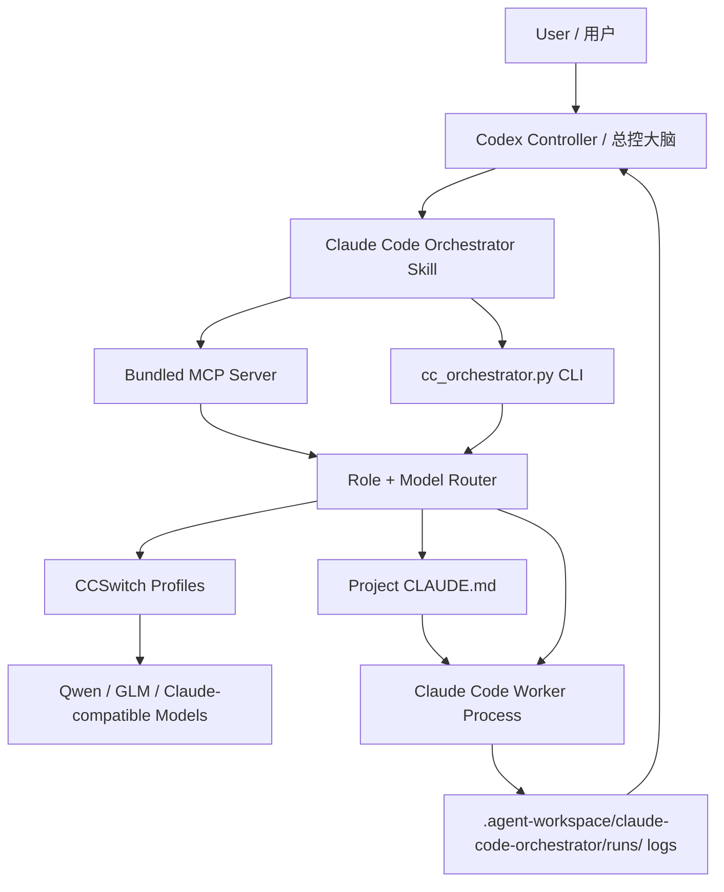

<p align="center">
  
</p>

<h1 align="center">Claude Code Orchestrator Skill</h1>

<p align="center">
  <b>一套把 Codex、Claude Code、CCSwitch 和多模型工人组织起来的世界级多 Agent 协作工程。</b>
</p>

<p align="center">
  <b>目标很直接：把它做成世界上最顶尖的多 Agent 协作工程。</b>
</p>

<p align="center">
  <b>让 Plus 的额度，用出 Pro 的效果。</b>
</p>

<p align="center">
  <b>A world-class multi-agent engineering harness for Codex, Claude Code, CCSwitch, and local model routing.</b>
</p>

<p align="center">
  <a href="README.md"></a>
  <a href="README.md"></a>
  <a href="LICENSE"></a>
  
  
  
  
</p>

---

<h2 align="center">中文版</h2>

众所周知，GPT / GPT Plus 很好用。

但现实问题也很直接：Plus 的额度不是无限的。

如果你在 Codex 里直接开很多子智能体，强模型会很快被烧光。

一次复杂项目拆解、一次多 Agent 审查、一次并行修复，就可能把本来很宝贵的额度消耗掉。

所以我做了这个 Skill。

它的目标就是：

> 让 Plus 的额度，用出 Pro 的效果。

所以这套 Skill 的思路是：

> 让最强、最好用的模型当“大脑”，负责判断、拆解、调度、验收；
> 让 Claude Code 和 CCSwitch 里的多个模型当“手”，负责跑子任务、做分析、写代码、做测试、做审查。

换句话说：

> Codex 不再亲自干所有脏活累活。
> Codex 负责做总控、做判断、做验收。
> Claude Code 负责带着本地模型工人去执行。

这不是一个普通脚本。

这是一套微型成本管理学。

它把多 Agent 协作变成一条清楚的工程流水线：

```text
Codex = 总控大脑
Claude Code = 可调用工人
CCSwitch = 本地模型路由器
MCP = 标准控制接口
Skill = Codex 的操作说明书
```

最终目标很简单：

> 用最少的高端模型额度，撬动最多的工程产出。

<h2 align="center">更新日志</h2>

<p align="center">
  <b>当前版本：v0.8.0</b>
</p>

| 版本 | 更新内容 | 为什么重要 |
| --- | --- | --- |
| `v0.8.0` | 新增 guarded runtime launch：provider 环境隔离、不可变启动合约、自定义 runtime 的“本机策略 + 单次请求”双授权、身份安全的进程控制、受保护的 prompt/队列传输，以及带认证和容量上限的安全审计。 | Codex 不再信任环境变量偷偷换 runtime，不会把 prompt/API 材料塞进进程元数据，也不会因为 PID 被复用而误停无关进程。 |
| `v0.7.1` | 修复 #24：手动执行 `workflow-retry-node` 后，workflow 顶层状态会从 `succeeded` 改成 `needs_rerun`，记录被 invalidated 的节点，并把旧 handoff/gate/token 证据标成 stale。 | Codex 和 dashboard 不会再把“已经被手动打回重跑”的 workflow 当成成功验收。pending 节点必须重新跑完，才能再次视为完成。 |
| `v0.7.0` | 新增 GitHub issues #20、#21、#22 的第一版工作流 DAG 控制层：YAML/JSON 工作流校验、dry-run 拓扑批次、mock 工作流运行、结构化 handoff 模板与校验、节点 gate、重试决策、loop guard、workflow status/report 和 MCP 工具。 | Codex 现在可以把长任务拆成一组可验证的小节点，而不是塞进一段越来越含糊的长对话。第一版先用 mock 安全闭环，不花模型额度，也能拿数据证明控制器逻辑靠谱。 |
| `v0.6.4` | 修复 GitHub issues #16、#17、#18：`final-only` 先过滤 raw stream 噪声再计算持久 stdout 预算；`--cwd` run 使用目标 cwd 自己的 artifact root，并用 run index 保证后续 poll；真实 token 聚合从 raw `modelUsage` 先计算，再做脱敏。 | Codex 现在有可验证的数据证据：短任务不会被 thinking/system 噪声提前打死，多个项目的 agent 产物不会串目录，usage/dashboard 也不会再显示假的 0 token。 |
| `v0.6.3` | 修复 GitHub Actions 文档部署里的密钥扫描误报：selftest 里的占位 token 样例改成拆分字符串。 | 文档站可以正常发布 v0.6.x，不会把安全的占位示例误判成真实密钥。 |
| `v0.6.2` | 修复 #15：捕获 Claude stream 里的 `modelUsage`，写成 `actual_model_usage`；metadata、dashboard、usage summary、控制报告都会区分“声明路由模型”和“实际计费模型”，并标出 `route_mismatch`。新增 `supervise-decision`，作为 `decision-review` 的兼容别名。 | Codex 现在能发现“看起来派了 A 模型，实际 Claude 用了 B 模型”的坑。路由、账单、报告都更可信。 |
| `v0.6.1` | 完成 GitHub issue 审核补丁：控制报告补齐按模型统计、每个 run 的耗时、token 估算、stdout/events 字节、warning/blocking 计数；dashboard 增加 token 估算；旧 metadata 写入也统一走 UTF-8/控制字符清洗。 | 这些 issue 不是“看起来关了”，而是能拿出更完整的验收证据。Codex 不用翻 raw 日志，也能判断 worker 到底跑得好不好。 |
| `v0.6.0` | 修复 GitHub issues #3-#12：角色团队事务化启动、输出/事件硬预算、final-only 模式、追加指令保留原模型、Windows UTF-8 检查、风险等级拆分、密钥扫描分类、源码/Agent 产物分离、运维面板、控制报告、监督决策审查。 | Codex 现在更像真正的总控：团队不会半启动后偷偷留下 worker，输出跑飞会被停，模型路线不会悄悄漂移，风险和验收证据也能导出成报告。 |
| `v0.5.1` | 修复 GitHub issues #1 和 #2：轻量 `tools/cc-orchestrator` 复制布局现在能找到 `version.json` 和 Prompt Pack；`clean-workspace` 不再提示删除刚初始化出来的骨架目录。 | 工作区治理更稳：轻量工具目录可以独立运行，清理命令也不会把初始化结果拆掉。 |
| `v0.5.0` | 新增工作区治理：`.agent-workspace` 产物路由、`init-workspace`、`workspace-status`、`migrate-data`、`clean-workspace`、`archive-runs`、`repair-mcp-paths`、`folder-policy`，并补齐对应 MCP 工具。 | Codex 现在能把 Claude Code worker 的日志、报告、看板、临时文件、回滚记录、模板和策略文件关进统一目录，不乱碰项目源码。 |
| `v0.4.1` | 新增滚动 `checkpoint-###.md` 总结、工具调用去重摘要、默认写入总控摘要文件的 controller poll，以及明确的 `queued/running/done/failed` 队列状态。 | Codex 平时只看决策级摘要，raw 日志继续留在磁盘审计，既省额度又更好控场。 |
| `v0.4.0` | 新增 Codex 总控手册、Prompt Pack、压缩版总控轮询、`cc_summarize_run`、`cc_compact_events`、一键验收评分、真正的队列策略、模型能力库、本机偏好保留、worker 质量历史、失败模式识别、时间线看板。 | Codex 不再只是等 worker 回来，而是能边看边管、发现跑偏就停、改完自动验收、持续学习哪个模型最适合哪类任务。 |
| `v0.3.0` | 新增 `cc_verify_run`、写入范围硬检查、mock streaming 端到端测试、任务队列、每日用量统计、升级迁移、MCP 自动注册、benchmark suite。 | 从“能跑 worker”，升级成“能验收、能回滚建议、能迁移、能低成本测试”的控制台。 |
| `v0.2.0` | 新增实时控制：`run-streaming`、`poll-run`、`stop-run`、`run-status`、角色团队、交叉审查、看板、报告、成本护栏。 | Codex 可以边看边管 Claude Code worker，不用盲等结果。 |
| `v0.1.0` | 完成 Skill + MCP + CLI 基座：CCSwitch 发现、模型评分、角色路由、`CLAUDE.md` 生成、可视 Claude Code 窗口、日志和安全默认值。 | 证明核心思路：Codex 当大脑，Claude Code 当执行层，CCSwitch 当本地模型路由器。 |

> [!IMPORTANT]
> v0.8.0 的生产级 guarded worker 执行目前仅支持 Windows。macOS 和 Linux 可以安装、配置、检查并验证 fail-closed 行为，但在具备内核强制的整棵进程树 containment 后端之前，真实 worker 启动会被阻止。

<h3 align="center">详细版本说明</h3>

<details open>
<summary><b>v0.8.0 - Guarded Runtime Launch</b></summary>

- Provider 配置只保留明确允许的字段，拒绝 loader、shell、PATH、Git config 和 orchestrator 控制变量。
- 自定义 runtime 必须同时具备完整递归 executable identity pin 和每次 CLI/MCP 请求的显式批准。
- 启动合约不可变且不含密钥，prompt 走受控 stdin，队列正文进入受保护存储，unsafe grant 只能消费一次。
- 后台、团队、workflow、队列和可视启动都使用身份感知 containment；旧版 PID-only run 不允许强停。
- 安全事件使用严格字段白名单、本地 hash chain、认证 checkpoint、私有失败标记和硬容量上限。
- Runtime CI 在 Windows 的 Python 3.10/3.12 上运行完整测试集。Ubuntu 和 macOS 运行专门的 POSIX 契约套件，覆盖进程身份、runtime 策略、受保护存储、安装/发布行为和生产 fail-closed 边界；Linux 还验证非 UTF-8 Git 路径的字节级精确性。

</details>

<details open>
<summary><b>v0.7.1 - 手动 retry 会取消 workflow 成功状态</b></summary>

- 修复 #24：`workflow-retry-node` 不会再让已 invalidated 的 workflow 顶层状态继续保持 `succeeded`。
- 手动 retry 后会写入 `needs_rerun`、`requires_rerun=true` 和 invalidated 节点列表。
- 被 invalidated 的节点不再把旧 `handoff`、`handoff_validation`、`gate`、run id、token、cost 当成当前验收证据暴露。
- workflow report 会显示手动 invalidation 警告和 stale evidence 标记。
- selftest 新增手动 retry 状态、旧证据清理、报告警告三组检查。

</details>

<details open>
<summary><b>v0.7.0 - 工作流 DAG、handoff 合约、节点 gate</b></summary>

- 实现 #20：新增 `workflow-validate`、`workflow-dry-run`、`workflow-run --mock`、`workflow-status`、`workflow-retry-node`、`workflow-stop`、`workflow-report`。v0.7.0 暂时只开放 mock DAG 执行，真实 worker DAG 执行等更多生产 gate 稳定后再打开。
- 实现 #21：新增 `handoff-template`、`handoff-validate`、`handoff-read`、`handoff-repair-prompt`。
- 实现 #22：新增 mock 节点控制器决策，支持 `advance`、`retry`、`block`、`cancel`、gate 检查、重试后下游失效、loop guard 阻断。
- 补齐 workflow / handoff 对应 MCP 工具。
- 新增 `examples/workflows/safe-refactor.yaml`。
- selftest 新增 DAG 校验、handoff 校验、重试、超过重试阻断、缺 handoff 阻断下游、报告 decision trail、controller 不改源码等 gate。

</details>

<details open>
<summary><b>v0.6.4 - 用数据验证的 worker 管控修复</b></summary>

- 修复 #16：`--final-only` 会先过滤 raw stream 事件，再计算持久 stdout 预算。
- 修复 #16：final-only stdout 只写紧凑最终结果，不再写 raw `system` / `assistant` stream JSON。
- 修复 #17：`run`、`run-streaming`、`run-visible` 会使用 `--cwd` 对应 workspace 下的 `.agent-workspace/claude-code-orchestrator`。
- 修复 #17：新增 run index，让 `poll-run`、`run-status`、`stop-run`、`last-run` 和统计报告仍能通过 run id 找到 cwd-scoped run。
- 修复 #18：真实 token 聚合从 raw Claude `modelUsage` 先计算，再写入脱敏后的日志和事件。
- Windows PID 检测从慢 `tasklist` 改为系统 API。
- `mock-stream-test` 新增 final-only 噪声过滤、cwd 产物路由、token 聚合保留三组数据 gate。

</details>

<details open>
<summary><b>v0.6.3 - 文档部署稳定性</b></summary>

- 修复 GitHub Actions 密钥扫描误报。
- 保留占位密钥的回归测试，但把样例 token 拆成字符串拼接，避免仓库级扫描把它当成真 key。
- 作为明确 hotfix 记录到 README、文档站 changelog、package 元数据和 version 元数据。

</details>

<details open>
<summary><b>v0.6.2 - 实际模型归因</b></summary>

- 修复 #15：streaming run 会把 Claude result 里的 `modelUsage` 保存为 `actual_model_usage`。
- run metadata/status 新增 `actual_model`、`actual_cost_usd`、`actual_total_tokens`、`route_mismatch`。
- `detect_failure_modes` 发现声明模型和实际模型不一致时，会产生高风险 `route_mismatch`。
- `usage-summary` 优先按实际模型统计，同时保留声明模型字段。
- dashboard 和控制报告会显示声明模型、实际模型、是否 mismatch、实际成本。
- `healthcheck` 增加说明：实际模型以 Claude stream result 为准。
- 新增 `supervise-decision`，作为 `decision-review` 的兼容别名，方便 #14 里的复测命令直接通过。

</details>

<details open>
<summary><b>v0.6.1 - issue 审核补丁</b></summary>

- `controller-report` / `pressure-report` Markdown 补齐按模型统计、总耗时、token 估算、输出字节、事件字节、预算停止次数、warning/blocking 计数和最高风险等级。
- 每个 run 的报告行新增耗时、token 估算、stdout/events 字节、warning/blocking 计数、预算状态、源码/产物变化数量。
- 本地运维 dashboard 的输出预算区域新增 token 估算。
- `usage-summary` 和按模型统计新增 warning/blocking 风险计数。
- 旧的 metadata 写入路径也统一使用 UTF-8/控制字符清洗，中文路径和中文 prompt 更稳。

</details>

<details open>
<summary><b>v0.6.0 - 总控运维加固</b></summary>

- 修复 #4：`spawn-role-team` 会先检查团队容量；如果中途失败，会停止已经启动的 run，不再静默留下 worker。
- 修复 #5：`run-streaming` / `cc_run_streaming_agent` 新增 `max_output_bytes`、`max_events_bytes`、`soft_output_bytes`、`output_budget_policy`、`kill_on_excessive_output`、`final_only`、`final_max_chars`。
- 修复 #6：`send-instruction` 默认保留上一次的 profile/model；如果显式改路由，会写入 route drift。
- 修复 #7：metadata、events、CLI JSON、dashboard 都会清洗非法控制字符，并保持中文路径和中文 prompt 的 UTF-8 可读。
- 修复 #8：风险结果新增 `blocking_ok`、`has_warnings`、`max_severity`、`warning_count`、`blocking_count`；旧 `ok` 保留，含义是“没有阻塞级风险”。
- 修复 #9：密钥扫描会区分真疑似密钥、示例值、变量名、配置键名和待人工复核项，输出永远脱敏。
- 修复 #10：run diff 和 diff summary 会分开显示项目源码改动和 `.agent-workspace` 里的 Agent 产物改动。
- 修复 #11：dashboard 升级成运维面板，显示 worker 筛选、心跳、停止原因、输出预算、风险等级、路由漂移、源码/产物分离。
- 修复 #12：新增 `controller-report` / `pressure-report`，以及 MCP `cc_controller_report` / `cc_pressure_report`，用于导出验收报告。
- 新增 #3 MVP：`decision-review` 和 MCP `cc_decision_review` 会生成监督审查结果：approve / revise / block、置信度、反对点、缺失证据和必须修改项。
- `mock-stream-test` 新增输出预算压测，不消耗真实模型额度。

</details>

<details open>
<summary><b>v0.5.1 - 便携资产和安全清理</b></summary>

- 修复 `tools/cc-orchestrator` 轻量复制布局：现在会从 `CC_ORCHESTRATOR_SKILL_ROOT`、完整 Skill 根目录，或 `scripts/cc-orchestrator` 同目录资产里发现资源。
- 在 `scripts/cc-orchestrator` 下补入便携版 `version.json` 和 Prompt Pack。
- `healthcheck` 新增 `skill_root`、`version_path`、`prompt_pack_path` 和 Prompt Pack 是否存在的输出。
- 修复 `clean-workspace`：刚初始化出来的核心骨架目录即使为空，也会被保护。
- selftest 新增 Prompt Pack 可用性和清理不删除骨架目录的回归检查。

</details>

<details open>
<summary><b>v0.5.0 - 工作区治理</b></summary>

- 新增默认产物目录：`.agent-workspace/claude-code-orchestrator`。
- 新增 `init-workspace`，一键创建 runs、reports、dashboard、archives、rollback、logs、tmp、templates、policies。
- 新增 `workspace-status`，直接查看 Codex 和 Claude Code 现在会把产物写到哪里。
- 新增 `migrate-data`，把旧 `runs`、`reports`、`dashboard` 安全迁移进统一目录。
- 新增 `clean-workspace`，默认 dry-run，用来清理 tmp、空目录和过期 run。
- 新增 `archive-runs`，把旧 run 打成 zip 放进 `archives/`。
- 新增 `repair-mcp-paths`，自动修 `.mcp.json` 里的 `CC_ORCHESTRATOR_WORKSPACE_ROOT` 和 `CC_ORCHESTRATOR_ARTIFACT_ROOT`。
- 新增 `folder-policy`，写清楚只管理 Agent 生成物，不乱碰项目源码。
- 新增 MCP 工具：`cc_init_workspace`、`cc_workspace_status`、`cc_migrate_data`、`cc_clean_workspace`、`cc_archive_runs`、`cc_repair_mcp_paths`、`cc_folder_policy`。
- 更新 worker prompt 和生成的 `CLAUDE.md`，让 Claude Code worker 把日志、报告、临时文件、回滚记录放进统一目录。

</details>

<details open>
<summary><b>v0.4.1 - 总控 checkpoint、工具去重、队列状态补强</b></summary>

- 新增滚动 `checkpoints/checkpoint-###.md`，用于长任务阶段总结。
- checkpoint 会写清楚：已做什么、发现什么、改了什么、还剩什么、是否跑偏。
- 新增工具调用去重摘要，例如 `Grep x7`、`Read x3`。
- `poll-run --mode controller` 默认写入总控摘要文件。
- 总控摘要新增 `last_meaningful_action`、`new_findings`、`tool_call_summary`、`controller_attention_flags`。
- 队列完成态改为 `done`，并明确支持 `queued`、`running`、`done`、`failed`、`timed_out`、`cancelled`。
- 本地 HTML dashboard 增加顶部模型路由、左侧 workers、中间 timeline/logs、右侧 diff/risk/controls。

</details>

<details open>
<summary><b>v0.4.0 - Codex 总控系统</b></summary>

- 新增 `references/codex-controller-playbook.md`，把 Codex 调度规则抽成专门手册。
- 写清楚什么时候 Codex 自己做，什么时候派 Claude Code worker。
- 写清楚 poll 节奏、跑偏信号、stop 条件、cross-review 条件、写代码许可条件。
- 新增 Prompt Pack：`repo-audit`、`bugfix`、`security-audit`、`frontend-polish`、`test-generation`、`refactor-plan`、`release-check`。
- 新增 `cc_poll_run --mode controller`，默认让 Codex 看压缩摘要，不再读 raw events。
- 新增 `cc_summarize_run` 和 `cc_compact_events`。
- 新增总控产物：`progress_summary.json`、`latest_decision.md`、`risk_flags.json`、`changed_files.json`、`tool_timeline.md`。
- 新增真正的队列策略：最大并发、优先级、重试、超时、状态统计。
- 新增 `model_registry.json` 和 `model_benchmark_history.json`。
- 新增 `local_policy.override.json`，升级时保留本机偏好。
- 新增 worker 质量评分历史，记录是否解决、是否越界、是否泄密、是否浪费 token、是否需要返工。
- 新增失败模式识别：卡住、重复搜索、大量无效输出、危险命令、测试失败还说成功、越界写文件、疑似密钥输出。
- 模型能力库会合并 CCSwitch 扫描、benchmark 历史和 worker 质量历史。
- 新增 MCP 工具：模型库、本机偏好、worker 评分、Prompt Pack、队列策略、事件压缩、run 总结。
- 新增每日 GitHub 更新检查 automation 的 README 指引。

</details>

<details>
<summary><b>v0.3.0 - 验收、打包、安全运行</b></summary>

- 新增一键 `cc_verify_run`。
- 把 diff summary、写入范围检查、密钥扫描、可选测试命令、Markdown 报告串成验收流水线。
- 新增 run 结束后的写入范围硬检查。
- 新增基于 git 快照的保守回滚助手。
- 新增 mock streaming 端到端测试，不消耗模型额度也能测 streaming。
- 新增 benchmark suite：代码、审查、安全、长上下文、多模态规划。
- 新增每日用量统计。
- 新增版本和升级状态机制。
- 新增 Windows MCP 自动注册安装器。
- 安装脚本加强本机配置保留。
- 新增 `version.json` 版本元数据。

</details>

<details>
<summary><b>v0.2.0 - 实时 worker 控制</b></summary>

- 新增 `run-streaming` / `cc_run_streaming_agent`。
- Claude Code 通过 `--output-format stream-json --include-partial-messages` 启动。
- 每次 run 写入实时 `events.ndjson`。
- 新增 `poll-run`、`run-status`、`stop-run`。
- 新增角色团队启动。
- 新增团队结果汇总。
- 新增交叉审查 worker loop。
- 新增 run 报告和导出流程。
- 新增本地 HTML dashboard 基础版。
- 新增成本护栏：并发和超时。
- 新增可视 Claude Code 窗口。

</details>

<details>
<summary><b>v0.1.0 - Skill、MCP、CLI、CCSwitch 基座</b></summary>

- 创建 Codex Skill 入口。
- 内置 MCP Server。
- 新增 CLI orchestrator。
- 新增 CCSwitch profile 发现。
- 新增 Claude Code 二进制发现。
- 新增本机模型按角色打分。
- 新增按角色路由模型。
- 默认只读 plan 模式。
- 新增 Claude Code 子进程执行。
- 新增 run metadata、prompt、stdout、stderr、last-run 日志。
- 新增 `CLAUDE.md` worker 人设生成。
- 新增 Windows UTF-8 输出保护。
- 新增密钥脱敏默认策略。
- 新增英文和中文 README 基础文档。

</details>

<h2 align="center">它到底是什么</h2>

`claude-code-orchestrator-skill` 是一个 Codex Skill，里面自带一套 MCP Server 和 CLI。

它可以让 Codex 做这些事：

- 自动发现你电脑上的 Claude Code。
- 自动读取你电脑上的 CCSwitch 配置。
- 自动读取 CCSwitch 里配置好的多个模型。
- 给每个模型按角色打分。
- 给不同 Agent 角色选择最合适的模型。
- 用 Claude Code 启动外部子 Agent。
- 默认只读，避免乱改文件。
- 把每个 Agent 的运行记录保存到 `.agent-workspace/claude-code-orchestrator`。
- 支持初始化、查看、清理、迁移、归档和约束 Agent 产物目录。
- 支持 MCP 工具调用。
- 支持可视 Claude Code 窗口。
- 支持中文、Windows、UTF-8 输出。
- 支持给项目写 `CLAUDE.md`，让 Claude Code 子 agent 有稳定人设和角色规则。

<h2 align="center">前置条件</h2>

必须先准备好这些东西：

1. **Codex**
   - 你需要在 Codex 里使用这个 Skill。

2. **Claude Code**
   - 本机必须能运行 Claude Code。
   - 命令行里最好能找到 `claude`。

3. **CCSwitch**
   - 本机必须安装 CCSwitch。
   - CCSwitch 里要配置好 Claude Code 可用的 provider。

4. **CCSwitch 里要有多个模型**
   - 例如：强代码模型、快模型、便宜模型、审查模型。
   - 模型越多，这套 Skill 的调度价值越大。

5. **Python 3.10+**
   - 用来跑 MCP Server 和 CLI。

最理想的配置是：

```text
Codex 已安装
Claude Code 已安装
CCSwitch 已安装
CCSwitch 里有多个模型
Claude Code 能走 CCSwitch 的 provider
```

<h2 align="center">一句话让 Agent 安装</h2>

把这句话丢给 Codex：

```text
请从 https://github.com/chu459/claude-code-orchestrator-skill 安装这个 Codex Skill 和自带 MCP。把 Skill 放到 ~/.codex/skills/claude-code-orchestrator，把自带 MCP 写进 Codex config.toml，然后运行 selftest、healthcheck、score-models、init-workspace、workspace-status，并把多 agent 路由策略展示给我。不要打印任何密钥。
```

English version:

```text
Install the Codex Skill and MCP server from https://github.com/chu459/claude-code-orchestrator-skill. Put the Skill at ~/.codex/skills/claude-code-orchestrator, wire the bundled MCP server into Codex config.toml, run selftest, healthcheck, score-models, init-workspace, workspace-status, and show me the selected multi-agent routing plan. Do not print secrets.
```

<h2 align="center">一行命令安装</h2>

Windows PowerShell：

```powershell
$tmp = Join-Path $env:TEMP "claude-code-orchestrator-skill.zip"; `
iwr -UseBasicParsing "https://github.com/rfdiosuao/claude-code-orchestrator-skill/archive/refs/tags/v0.8.0.zip" -OutFile $tmp; `
$dir = Join-Path $env:TEMP "claude-code-orchestrator-skill"; `
if (Test-Path $dir) { Remove-Item $dir -Recurse -Force }; `
Expand-Archive $tmp -DestinationPath $dir -Force; `
& (Get-ChildItem $dir -Recurse -Filter install.ps1 | Select-Object -First 1).FullName
```

macOS / Linux：

```bash
tmp="$(mktemp -d)" && \
curl -L "https://github.com/rfdiosuao/claude-code-orchestrator-skill/archive/refs/tags/v0.8.0.zip" -o "$tmp/skill.zip" && \
unzip -q "$tmp/skill.zip" -d "$tmp" && \
bash "$tmp"/claude-code-orchestrator-skill-0.8.0/install/install.sh
```

只有在不可变的 `v0.8.0` tag 发布后才能用于生产安装。请把归档 SHA-256 记入部署日志，禁止替换成 `main.zip`。

<h2 align="center">手动安装</h2>

```bash
git clone https://github.com/chu459/claude-code-orchestrator-skill.git
cd claude-code-orchestrator-skill
```

Windows：

```powershell
.\install\install.ps1
```

macOS / Linux：

```bash
bash install/install.sh
```

安装后会复制到：

```text
~/.codex/skills/claude-code-orchestrator
```

<h2 align="center">配置 MCP</h2>

把下面内容加到 Codex 的 `config.toml`：

```toml
[mcp_servers.claude-code-orchestrator]
command = "python"
args = [
  "-c",
  "import os,sys,runpy; home=os.environ.get('CODEX_HOME') or os.path.join(os.environ.get('USERPROFILE') or os.path.expanduser('~'), '.codex'); root=os.environ.get('CC_ORCHESTRATOR_HOME') or os.path.join(home, 'skills', 'claude-code-orchestrator', 'scripts', 'cc-orchestrator'); sys.path.insert(0, root); runpy.run_path(os.path.join(root, 'server.py'), run_name='__main__')"
]

[mcp_servers.claude-code-orchestrator.env]
PYTHONIOENCODING = "utf-8"
PYTHONUTF8 = "1"
CC_ORCHESTRATOR_WORKSPACE_ROOT = "."
CC_ORCHESTRATOR_ARTIFACT_ROOT = ".agent-workspace/claude-code-orchestrator"
```

也可以直接用安全安装脚本写入 Codex / Claude MCP 配置。脚本会先备份旧配置：

```powershell
powershell -ExecutionPolicy Bypass -File .\install\install-mcp.ps1
```

同样的配置也在：

```text
docs/mcp.codex.example.toml
```

<h2 align="center">快速自检</h2>

```powershell
$env:CC_ORCHESTRATOR_HOME = "$env:USERPROFILE\.codex\skills\claude-code-orchestrator\scripts\cc-orchestrator"
python "$env:CC_ORCHESTRATOR_HOME\cc_orchestrator.py" selftest
python "$env:CC_ORCHESTRATOR_HOME\cc_orchestrator.py" healthcheck
python "$env:CC_ORCHESTRATOR_HOME\cc_orchestrator.py" score-models
python "$env:CC_ORCHESTRATOR_HOME\cc_orchestrator.py" init-workspace --cwd .
python "$env:CC_ORCHESTRATOR_HOME\cc_orchestrator.py" workspace-status --cwd .
python "$env:CC_ORCHESTRATOR_HOME\cc_orchestrator.py" workflow-plan "Refactor this project safely"
```

你应该看到：

- `selftest.ok = true`
- `healthcheck.ok = true`
- 能发现 CCSwitch profile
- 能列出 CCSwitch 里的模型
- 能初始化 `.agent-workspace/claude-code-orchestrator`
- 能看到 runs、reports、dashboard 会写到哪里
- 能生成多 Agent 路由计划

<h2 align="center">常用命令</h2>

健康检查：

```bash
python "$CC_ORCHESTRATOR_HOME/cc_orchestrator.py" healthcheck
```

列出 CCSwitch profiles：

```bash
python "$CC_ORCHESTRATOR_HOME/cc_orchestrator.py" list-profiles
```

给本机模型打分：

```bash
python "$CC_ORCHESTRATOR_HOME/cc_orchestrator.py" score-models
```

生成策略报告：

```bash
python "$CC_ORCHESTRATOR_HOME/cc_orchestrator.py" write-reports
```

给项目写 Claude Code 子 agent 人设文档：

```bash
python "$CC_ORCHESTRATOR_HOME/cc_orchestrator.py" write-claude-md --cwd /path/to/project --role implementation
```

跑一个只读 Agent：

```bash
python "$CC_ORCHESTRATOR_HOME/cc_orchestrator.py" run "Map this repository architecture" --role architecture
```

跑一个实时可轮询的后台 Agent：

```bash
python "$CC_ORCHESTRATOR_HOME/cc_orchestrator.py" run-streaming "Review this repository" --role review
```

轮询、查看、停止后台 Agent：

```bash
python "$CC_ORCHESTRATOR_HOME/cc_orchestrator.py" poll-run --run-id <run_id>
python "$CC_ORCHESTRATOR_HOME/cc_orchestrator.py" run-status
python "$CC_ORCHESTRATOR_HOME/cc_orchestrator.py" stop-run --run-id <run_id> --force
```

启动和汇总角色团队：

```bash
python "$CC_ORCHESTRATOR_HOME/cc_orchestrator.py" spawn-role-team "Audit this repository" --roles requirements,architecture,security,testing
python "$CC_ORCHESTRATOR_HOME/cc_orchestrator.py" collect-team-results --team-id <team_id>
python "$CC_ORCHESTRATOR_HOME/cc_orchestrator.py" cross-review --run-id <run_id> --run-id <run_id>
```

写入前检查和验收：

```bash
python "$CC_ORCHESTRATOR_HOME/cc_orchestrator.py" preflight-write-scope --cwd /path/to/project --allow src --deny .env --max-diff-lines 800
python "$CC_ORCHESTRATOR_HOME/cc_orchestrator.py" check-write-scope --cwd /path/to/project
python "$CC_ORCHESTRATOR_HOME/cc_orchestrator.py" diff-summary --cwd /path/to/project
python "$CC_ORCHESTRATOR_HOME/cc_orchestrator.py" secret-scan-run --run-id <run_id>
python "$CC_ORCHESTRATOR_HOME/cc_orchestrator.py" verify-run --run-id <run_id> --test-command "npm test"
```

模型调度和报告：

```bash
python "$CC_ORCHESTRATOR_HOME/cc_orchestrator.py" benchmark-model --profile PROFILE --execute
python "$CC_ORCHESTRATOR_HOME/cc_orchestrator.py" benchmark-suite --profile PROFILE
python "$CC_ORCHESTRATOR_HOME/cc_orchestrator.py" calibrate-policy --preference coding=glm-5 --preference multimodal=qwen3.7-plus
python "$CC_ORCHESTRATOR_HOME/cc_orchestrator.py" cost-guard --max-concurrent 4 --max-timeout-seconds 1200 --apply
python "$CC_ORCHESTRATOR_HOME/cc_orchestrator.py" usage-summary --write-report
python "$CC_ORCHESTRATOR_HOME/cc_orchestrator.py" init-workspace
python "$CC_ORCHESTRATOR_HOME/cc_orchestrator.py" workspace-status
python "$CC_ORCHESTRATOR_HOME/cc_orchestrator.py" migrate-data
python "$CC_ORCHESTRATOR_HOME/cc_orchestrator.py" clean-workspace
python "$CC_ORCHESTRATOR_HOME/cc_orchestrator.py" archive-runs --older-than-days 30
python "$CC_ORCHESTRATOR_HOME/cc_orchestrator.py" repair-mcp-paths --create
python "$CC_ORCHESTRATOR_HOME/cc_orchestrator.py" folder-policy --apply
python "$CC_ORCHESTRATOR_HOME/cc_orchestrator.py" queue-submit "Review this repo" --role review --priority 100
python "$CC_ORCHESTRATOR_HOME/cc_orchestrator.py" queue-tick --max-concurrent 3
python "$CC_ORCHESTRATOR_HOME/cc_orchestrator.py" queue-policy --max-concurrent 3 --default-timeout-seconds 900 --apply
python "$CC_ORCHESTRATOR_HOME/cc_orchestrator.py" model-registry --refresh --apply
python "$CC_ORCHESTRATOR_HOME/cc_orchestrator.py" local-policy --preference development=GLM5.2 --preference multimodal=qwen3.7-plus --apply
python "$CC_ORCHESTRATOR_HOME/cc_orchestrator.py" score-worker --run-id <run_id>
python "$CC_ORCHESTRATOR_HOME/cc_orchestrator.py" summarize-run --run-id <run_id>
python "$CC_ORCHESTRATOR_HOME/cc_orchestrator.py" render-prompt --template bugfix --task "Fix the bug"
python "$CC_ORCHESTRATOR_HOME/cc_orchestrator.py" upgrade-check --apply
python "$CC_ORCHESTRATOR_HOME/cc_orchestrator.py" mock-stream-test
python "$CC_ORCHESTRATOR_HOME/cc_orchestrator.py" dashboard
python "$CC_ORCHESTRATOR_HOME/cc_orchestrator.py" export-report --run-id <run_id>
```

打开可视 Claude Code 窗口：

```bash
python "$CC_ORCHESTRATOR_HOME/cc_orchestrator.py" run-visible "Inspect this repository" --role architecture
```

查看最后一次运行：

```bash
python "$CC_ORCHESTRATOR_HOME/cc_orchestrator.py" last-run
```

<h2 align="center">MCP 工具</h2>

这套 Skill 自带 MCP Server。

Codex 可以调用这些工具：

| Tool | 用途 |
| --- | --- |
| `cc_healthcheck` | 检查 Claude Code、CCSwitch、配置 |
| `cc_list_profiles` | 列出 CCSwitch profiles |
| `cc_pick_profile` | 给某个角色选择模型 |
| `cc_run_agent` | 跑一个 Claude Code 子 Agent |
| `cc_run_streaming_agent` | 启动带 `stream-json` 事件的后台 Claude Code worker |
| `cc_poll_run` | 默认查询压缩后的总控进度，也可切到 raw 模式看原始增量 |
| `cc_summarize_run` | 写入并返回总控摘要和滚动 checkpoint |
| `cc_compact_events` | 把原始 `events.ndjson` 压缩成小时间线和去重工具摘要 |
| `cc_stop_run` | 停止指定 run id 的 Claude Code worker |
| `cc_run_status` | 列出正在运行的 workers，或查看某个 run |
| `cc_send_instruction` | 通过“停止并带上下文重启”追加指令 |
| `cc_spawn_role_team` | 一次启动多个角色 worker |
| `cc_collect_team_results` | 汇总团队输出，标出一致结论和冲突风险 |
| `cc_cross_review` | 启动二轮交叉审查 worker |
| `cc_preflight_write_scope` | 写代码前固定允许目录、禁止文件和最大 diff |
| `cc_check_write_scope` | 检查 run 是否越过写入范围，越界就阻止验收 |
| `cc_diff_summary` | 总结 diff 改了什么、风险在哪、是否需要测试 |
| `cc_secret_scan_run` | 扫描 run 日志、事件和 diff，防止密钥泄漏 |
| `cc_rollback_run` | 在 git 快照证明安全时保守回滚 |
| `cc_verify_run` | 串起 diff、写入范围、密钥扫描、测试和报告 |
| `cc_benchmark_model` | 运行或规划小任务模型实测 |
| `cc_benchmark_suite` | 运行或规划代码修复、审查、安全、长上下文、多模态基准 |
| `cc_model_registry` | 生成本机模型能力数据库 |
| `cc_calibrate_policy` | 固化本机模型偏好 |
| `cc_local_policy` | 读写本机路由偏好，升级时保留 |
| `cc_score_worker` | 给某次 worker 运行打分并记录质量历史 |
| `cc_prompt_pack` | 列出或渲染可复用 worker 提示词 |
| `cc_cost_guard` | 配置最大并发和超时护栏 |
| `cc_usage_summary` | 从日志估算每日 token、耗时、失败率和模型用量 |
| `cc_queue_submit` | 提交一个优先级队列任务 |
| `cc_queue_tick` | 按并发上限启动排队任务 |
| `cc_queue_status` | 查看 `queued`、`running`、`done`、`failed`、`timed_out`、`cancelled` 队列状态 |
| `cc_queue_cancel` | 取消排队或运行中的任务 |
| `cc_queue_policy` | 读写队列并发、重试和超时策略 |
| `cc_upgrade_check` | 升级时保留本机模型偏好、模型库、质量历史、队列策略和成本配置 |
| `cc_mock_stream_test` | 用 fake Claude 流测试 streaming、poll、stop、status |
| `cc_init_workspace` | 初始化 `.agent-workspace`、模板、策略文件、回滚/日志目录和可选 `CLAUDE.md` |
| `cc_workspace_status` | 查看 Codex 和 Claude Code 产物会写到哪里 |
| `cc_migrate_data` | dry-run 或迁移旧 `runs`、`reports`、`dashboard` 到统一目录 |
| `cc_clean_workspace` | 清理 tmp、空目录和过期 run，默认 dry-run |
| `cc_archive_runs` | 把旧 run 打包到 `archives/` |
| `cc_repair_mcp_paths` | 修 `.mcp.json`，让 MCP 写入统一目录 |
| `cc_folder_policy` | 返回或写入“只管理 Agent 产物”的目录规则 |
| `cc_dashboard` | 生成本地 HTML worker 面板 |
| `cc_open_run_folder` | 打开或返回某次 run 日志目录 |
| `cc_export_report` | 导出 run 或 team 的 Markdown 报告 |
| `cc_controller_report` | 导出总控验收和压测证据报告 |
| `cc_pressure_report` | 压测报告别名 |
| `cc_decision_review` | 监督式 approve/revise/block 决策审查 |
| `cc_run_visible_agent` | 打开可视 Claude Code 窗口 |
| `cc_last_run` | 查看最后一次运行 |
| `cc_git_diff` | 查看子 Agent 修改后的 diff |
| `cc_workflow_plan` | 生成多 Agent 工作流 |
| `cc_workflow_validate` | 校验 YAML/JSON 工作流 DAG |
| `cc_workflow_dry_run` | 预览拓扑批次 |
| `cc_workflow_run` | 运行工作流；`mock=true` 不花模型额度 |
| `cc_workflow_status` | 查看节点状态、gate 细节和决策 |
| `cc_workflow_retry_node` | 让一个节点和下游节点失效，准备重试 |
| `cc_workflow_stop` | 取消工作流 |
| `cc_workflow_report` | 写出带 decision trail 的工作流报告 |
| `cc_handoff_template` | 返回角色 handoff schema 和示例 |
| `cc_handoff_validate` | 校验 run handoff |
| `cc_handoff_read` | 读取 run handoff |
| `cc_handoff_repair_prompt` | 生成缺字段修复 prompt |
| `cc_write_claude_md` | 给项目写 Claude Code 子 agent 的 `CLAUDE.md` 人设文档 |
| `cc_score_models` | 给本机模型打分 |
| `cc_write_strategy_reports` | 写出模型评分和调度报告 |

<h2 align="center">给 Claude Code 子 Agent 配置 CLAUDE.md</h2>

Claude Code 可以读取项目里的 `CLAUDE.md`。

这件事对多 agent 调度很重要。

因为 Codex 可以先给 Claude Code 写好人设、边界和角色规则，再让它作为外部子 agent 去干活。

生成的 `CLAUDE.md` 会告诉 Claude Code：

- Codex 是总控、规划者、审查者和最终决策者。
- Claude Code 是外部 worker。
- 当前角色是什么，比如 `architecture`、`implementation`、`review`。
- 不要泄露密钥，不要乱跑破坏性命令，不要回滚无关改动。
- 长任务要报告阶段和验证结果。

创建一个：

```bash
python "$CC_ORCHESTRATOR_HOME/cc_orchestrator.py" write-claude-md --cwd /path/to/project --role review
```

如果项目里已经有 `CLAUDE.md`，默认不会覆盖：

- 默认：不覆盖。
- `--append`：追加一段 orchestrator 托管内容。
- `--force`：先备份，再替换。

通过 MCP，Codex 可以调用：

```text
cc_write_claude_md
```

推荐流程：

```text
1. Codex 先规划任务
2. Codex 给对应角色写 CLAUDE.md
3. Codex 通过这个 Skill 启动 Claude Code
4. Claude Code 按项目人设和角色规则执行
5. Codex 审查日志、diff 和最终输出
```

<h2 align="center">每日更新检查</h2>

你可以让 Codex 创建一个每日自动化，定时检查 `chu459/claude-code-orchestrator-skill` 有没有新 commit。

推荐行为：

- 汇报 GitHub 最新 commit
- 汇报本地 `HEAD`
- 汇报已安装 Skill 版本
- 总结更新内容
- 默认绝不自动拉取、安装、覆盖
- 只有明确开启 `auto_apply` 才允许自动应用

可直接对 Codex 说：

```text
创建一个每日 Codex 自动化，检查 chu459/claude-code-orchestrator-skill 是否有新 commit。汇报远端 commit、本地 HEAD、已安装 Skill 版本、未提交改动和简短摘要。不要 pull 或应用更新，除非 auto_apply 已明确开启。
```

<h2 align="center">多 Agent 角色</h2>

默认角色：

| Role | 作用 |
| --- | --- |
| `requirements` | 需求、边界、验收标准 |
| `architecture` | 架构、文件、风险、方案 |
| `security` | 密钥、权限、破坏性操作、安全风险 |
| `testing` | 测试计划、验证命令、残余风险 |
| `implementation` | 受控写代码 |
| `review` | 代码审查、问题排序 |
| `ops` | 部署、日志、回滚、运行风险 |

<h2 align="center">成本管理学：大脑和手</h2>

这套 Skill 的核心不是“多开几个 Agent”。

核心是：

```text
大脑：最强模型，负责判断和验收
手：多个更便宜、更快、额度更充足的模型，负责执行
账本：每个 run 都有 metadata、stdout、stderr
总控：Codex 决定谁做什么，什么时候停
```

这就是微型成本管理学。

不是让所有模型乱跑。

而是把每个模型放到它最划算的位置。

<h2 align="center">架构图</h2>



<h2 align="center">安全默认值</h2>

默认非常保守：

- 默认只读。
- 默认 `permission_mode = plan`。
- 只有显式 `allow_write=true` 才允许写文件。
- 不修改 CCSwitch 全局状态。
- 不打印 API Key。
- 日志里会做密钥脱敏。
- Windows 中文输出强制 UTF-8。
- 超时后尽量保留部分 stdout/stderr。
- 已有 `CLAUDE.md` 默认不覆盖，除非显式使用 `--append` 或 `--force`。
- 工作区治理只管理 `.agent-workspace/claude-code-orchestrator` 里的 Agent 产物，不清理项目源码。

<h2 align="center">实时进度怎么看</h2>

当前可用方法：

1. 用 `run-streaming` 启动后台 Claude Code worker。
2. 用 `poll-run` 实时查看压缩后的总控进度、风险、改动文件和时间线。
3. 用 `run-status` 查看所有正在运行的 workers。
4. 用 `stop-run` 停掉跑偏、卡住、成本异常的 worker。
5. 用 `run-visible` 打开 Claude Code 窗口。

Windows：

```powershell
Get-Content ".agent-workspace\claude-code-orchestrator\runs\<run_id>\stdout.txt" -Wait
Get-Content ".agent-workspace\claude-code-orchestrator\runs\<run_id>\events.ndjson" -Wait
```

macOS / Linux：

```bash
tail -f ".agent-workspace/claude-code-orchestrator/runs/<run_id>/stdout.txt"
tail -f ".agent-workspace/claude-code-orchestrator/runs/<run_id>/events.ndjson"
```

P0 实时掌控四件套已经可用：

```text
cc_run_streaming_agent
cc_poll_run -> 压缩总控进度、风险、改动文件、时间线
cc_summarize_run -> 写入总控摘要和 checkpoint-###.md
cc_stop_run
cc_run_status
```

这样 Codex 可以实时看到：

- 哪个 Agent 在跑
- 用的是哪个模型
- 跑了多久
- 当前阶段是什么
- 最近输出是什么
- 有没有超时风险
- 这次是不是太贵

完整想法见：

```text
docs/realtime-progress.md
```

<h2 align="center">开源定位</h2>

这套项目的目标很夸张：

> 成为世界上最顶尖的多 Agent 协作工程之一：强模型做大脑，便宜模型做手，Codex 做总控，MCP 做神经系统。

它不是为了炫技。

它是为了把真实工程里的模型成本、上下文成本、人工注意力成本，全都纳入调度。

<h2 align="center">Roadmap</h2>

- [x] Codex Skill
- [x] Bundled MCP Server
- [x] CCSwitch profile discovery
- [x] Local model scoring
- [x] Role-based model routing
- [x] Claude Code subprocess launching
- [x] Visible Claude Code window
- [x] UTF-8 safe Windows output
- [x] Run logs and `last-run`
- [x] `CLAUDE.md` worker persona writer
- [x] Live event stream with `events.ndjson`
- [x] Poll/stop/status tools for live control
- [x] Role team spawning and result collection
- [x] Cross-review worker loop
- [x] Preflight write-scope file
- [x] Diff summary and secret scan helpers
- [x] Conservative rollback helper
- [x] 自动验收流水线 `verify-run`
- [x] mock streaming 端到端测试
- [x] run 结束后的写入范围硬检查
- [x] 带优先级、并发、超时、重试信息的任务队列
- [x] 从日志生成每日用量估算
- [x] version.json 和升级状态机制
- [x] Windows MCP 自注册安装器
- [x] 固定 benchmark suite 入口
- [x] Model benchmark/calibration entrypoints
- [x] Cost guard policy
- [x] Local HTML dashboard
- [x] Codex Controller Playbook
- [x] Prompt Pack
- [x] Compact controller-mode polling
- [x] Rolling checkpoint summaries
- [x] Tool-call deduplication
- [x] Run timeline visualization
- [x] Model registry and benchmark history
- [x] Local policy override preserved across upgrades
- [x] Worker quality scoring
- [x] Failure-mode detection
- [x] Queue policy with priority, retry, timeout, and max concurrency
- [x] `.agent-workspace` 产物路由
- [x] 工作区初始化、状态、迁移、清理和归档工具
- [x] MCP 路径修复和目录策略
- [x] Daily update monitor automation
- [x] Web-style local dashboard
- [ ] Agent result voting

<h2 align="center">免责声明</h2>

This project is not affiliated with OpenAI, Anthropic, Claude, Claude Code, or CCSwitch.

请遵守你所使用模型、平台和工具的服务条款。

---
